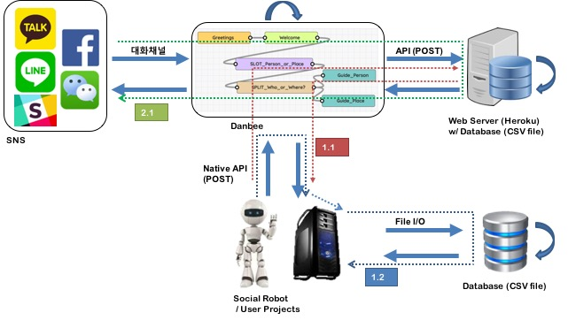

# ReceptionBot

source speech/bin/activate  (To stop: type 'deactivate')
## Source
```
$ git clone https://github.com/cjs0818/receptionbot.git
$ cd receptionbot
```
### python3 virtualenv
```
$ virtual env -p python3 venv3
$ source venv3/bin/activate     # 가상환경 끝낼 때는 deactivate를 입력할 것
$ python3 install -r requirements.txt   # OSX에 맞게 선택 OSX: requirements_osx.txt,  Ubuntu: requirements_docker.txt
```
### Run 
```
$ python3 webclient.py
```


## Architectrue

There are several options.

1. User Web API as a Client 
|     | Client | Server1 | Server2 |
|-----|--------|--------|--------|
| **1.1** | User Web Client   |  Chatbot (Danbee) | Heroku App. w/ CSV file  |
| **1.2** | User Web Client w/ CSV file   |  Chatbot (Danbee) |  |

2. SNS (Kakao Talk) as a Client
|     |Client | Server1 | Server2 |
|-----|--------|--------|--------|
| **2.1** | SNS (Kakao Talk)    |  Chatbot (Danbee) | Heroku App. w/ CSV file |



## What do we need for ++ReceptionBot++?
- Chatbot Platform - ++Danbee++ ([http://danbee.ai](http://danbee.ai))
- Web API server - ++Heroku++ ([http://www.heroku.com](http://www.heroku.com))
-  User Web client or SNS (ex. *Kakao Talk)*


## Steps

### User Projects <-> Danbee 
1. Make your Bot (*ReceptionBot*) and a Chatflow in the Bot. (Remember you Chatbot ID in Settings)
2. Add the following codes in your projects

```
    # --------------------------------
    # Danbee 요청
    # --------------------------------
    data_send = {
        'chatbot_id': 'c54e4466-d26d-4966-af1f-ca4d087d0c4a',  # Chatbot ID
        'input_sentence': text
    }
    data_header = {
        "Content-Type": "application/json;charset=UTF-8"
    }
    danbee_chatflow_url = 'https://danbee.ai/chatflow/engine.do'
    res = requests.post(danbee_chatflow_url,
                        data=json.dumps(data_send),
                        headers=data_header)
    # --------------------------------
    # 대답 처리
    # --------------------------------
    data_receive = res.json()

    message = data_receive['responseSet']['result']['result'][0]['message']
```

### Git & Heroku
- Git add & commit
  ```
  $ git add .
  $ heroku git:remote -a <app_name>
  $ git commit -am "modified"
  ```
- Modify your codes (**main.py** for Heroku server, **webclient.py** for User Web Client)
  ```
  $ git add .
  $ git commit -am "label_you_want"
  ```
  
- Upload to Heroku
  ```
  $ git push heroku master
  ```
- Execute Heroku
  ```
  $ heroku ps:scale web=1
  ```
- Check the log of Heroku
  ```
  $ heroku logs --tail
  $ heroku local web      # In local computer
  ```
  


